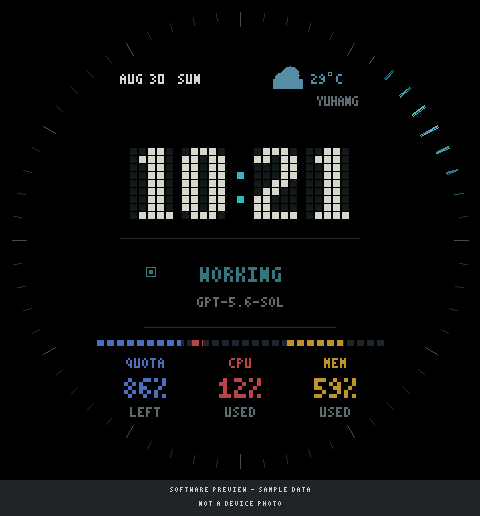

# M5StackHub · StopWatch Firmware

M5Stack StopWatch 的 Codex 状态表盘固件，采用工业点阵字体和环绕刻度波前动画。

[GitHub 仓库](https://github.com/EggUncle/M5StackHub) ·
[自动构建记录](https://github.com/EggUncle/M5StackHub/actions/workflows/build.yml)



> 上图为根据当前固件字形和坐标离线绘制的示意图，不是真机截图。
> `86%`、时间、天气和模型均为示例；固件没有固定显示 86% 的演示模式。
> 图中 `YUHANG` 对应真机的“余杭”。[查看多状态配图与差异说明](docs/interface.md)。

**此仓库仅包含 StopWatch 固件，不包含 Mac 端 M5StackHub 应用。**
配额、工作状态、天气、CPU 和内存必须由兼容的主机端提供。

## 文档导航

- [上手、编译与安全烧录](docs/quickstart.md)
- [界面、配色、状态与截图说明](docs/interface.md)
- [USB / BLE 通信协议与示例](docs/protocol.md)
- [常见问题与排障](docs/troubleshooting.md)
- [构建和验证记录](docs/verification.md)

## 当前功能

- 中央 5×9 点阵时间；日期、状态和资源数值使用 3×5 点阵字形。
- 配额（蓝色，剩余比例）、Mac CPU（红色，使用率）、Mac 内存（黄色，使用率）。
- Codex 工作状态、模型名称和工作时的青色波前动画；动画采用局部 DMA 刷新。
- 时间与余杭天气由 Mac 端下发；固件不自行联网查询天气或 Codex 配额。
- 保留 BLE/USB 行协议、屏幕休眠与唤醒、防烧屏位移逻辑。

当前版本将指标放在下方三列，外圈用于中性刻度和工作状态波前，
**不是早期的红黄蓝三段环版本**。不显示宠物。

| 指标 | 颜色 | 数字与进度条含义 |
| --- | --- | --- |
| QUOTA / LEFT | 蓝色 | Codex 周配额剩余百分比 |
| CPU / USED | 红色 | Mac CPU 使用百分比 |
| MEM / USED | 黄色 | Mac 内存使用百分比 |

## 硬件与构建

仅支持本项目验证过的 **M5Stack StopWatch / ESP32-S3（16MB Flash、8MB PSRAM）**。
PlatformIO 的 `esp32s3box` 是沿用的编译配置名，**不代表适用于 ESP32-S3-BOX 实物**。
不要烧录到 StackChan、CoreS3 或其他设备。

依赖固定为 Espressif32 6.12.0、M5GFX 0.2.26、
M5Unified 提交 `4fb444784c85791e0b0207701392b42be234b2e7`。
无需本机缓存、其他项目目录或宠物素材。

```sh
python3 -m venv .venv
source .venv/bin/activate
python -m pip install platformio==6.1.18
pio run -e stopwatch_pet
```

先确认设备端口，再烧录：

```sh
pio device list
# 把示例端口替换为上一条命令确认的 StopWatch 端口。
export STOPWATCH_PORT='/dev/cu.usbmodemXXXX'
pio run -e stopwatch_pet -t upload --upload-port "$STOPWATCH_PORT"
pio device monitor -p "$STOPWATCH_PORT" -b 115200
```

烧录会覆盖应用固件。设备固件来源不明时先备份；不要执行整片擦除或导入其他硬件的备份。

## 数据来源与配套应用

此仓库仅整理设备固件，**不包含 Mac 端 M5StackHub 应用或 Codex 会话数据**。
固件需要兼容的 Mac 端桥接程序提供任务状态、配额、天气和系统指标；
单独烧录不会自动获得这些数据。完整字段、UUID、示例和注意事项见
[通信协议](docs/protocol.md)，服务 UUID 与现有 M5StackHub 保持兼容。

触摸激活事件可交给 Mac 端处理唤醒/聚焦，但固件不能独自唤醒已断开 BLE 的 Mac，
也不承诺支持深度休眠或关机后的远程开机。

## 仓库结构

```text
src/main.cpp             固件与现有协议
platformio.ini           固定构建配置
.github/workflows/       自动编译配置
docs/                    使用、界面、协议、排障与验证文档
docs/screenshots/        软件示意图、原始设计稿截图和离线预览
scripts/                 文档配图生成与校验工具
```

配图生成不连接设备、不访问账户数据，也不会编译或烧录固件：

```sh
node scripts/render-doc-images.mjs
node scripts/check-docs.mjs
```

无需额外 npm 依赖；生成脚本使用 Node.js 内置模块。生成来源及其限制见
[配图说明](docs/interface.md#配图来源与复现)。

## 版本来源与验证边界

基于 2026-08-30 已烧录的工业点阵表盘版本整理。原始已烧录应用 SHA-256：

`81dbee73a9200fbf0f6059392cfc60c0fa0a78f227265f58143aef5458bb2cee`

独立版只隔离不使用的宠物素材编译分支，并将诊断标识改为 `stopwatch`。
因此新构建的二进制不保证与上述原始构建字节一致。
独立版的编译验证结果见 [验证记录](docs/verification.md)；没有重新烧录设备。

## 发布范围与隐私

不包含宠物原画及生成头、Flash/NVS 全量备份、蓝牙配对记录、会话日志、
账户令牌、凭据、本机构建缓存或其他硬件项目。第三方库由构建工具下载，不复制进仓库。
未擅自附加开源许可证；若需要公开开源，仓库所有者需决定授权方式。
