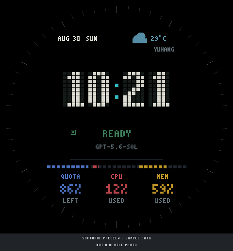
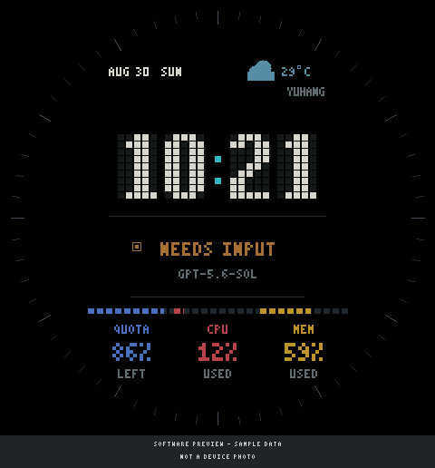
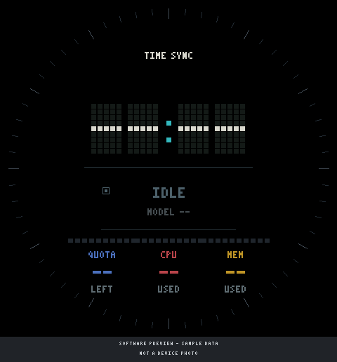

# 界面、状态与配图

[返回首页](../README.md)

当前界面为工业点阵方案：中央时钟、上方日期和天气、中间工作状态、下方三列指标。
外圈是中性刻度，工作时由青色波前沿刻度移动。历史三段资源圆环和宠物不再是当前界面。

## 工作中


`running` 对应 `WORKING`。外圈波前约 3.6 秒一周，使用约 16ms 的调度间隔和局部 DMA 更新。
这是代码设置，不是对实际屏幕帧率的测量。静态图只展示一个相位，不能用于证明动画流畅度。
进入减少动态效果模式后不显示工作波前。

中央时间使用 5×9 点阵数字；日期、状态、模型和资源信息使用 3×5 点阵字体。
数字为暖灰，暗点保留矩阵结构；冒号为青色，**不是只在 WORKING 时亮起的状态灯**。

## 就绪与等待输入

| READY | NEEDS INPUT |
| --- | --- |
|  |  |

| 主机状态 | 表盘文字 | 含义与表现 |
| --- | --- | --- |
| `idle` | IDLE | 空闲，灰蓝色，无波前 |
| `running` | WORKING | 正在工作，青色状态和外圈波前 |
| `needs_input` | NEEDS INPUT | 等待用户输入，琥珀色，无波前 |
| `ready` | READY | 主机报告就绪/完成，绿色，无波前 |
| `blocked` | BLOCKED | 主机报告阻塞，红色，无波前 |

这些状态由主机下发，固件不直接观察 Codex 任务。`READY` 不等于蓝牙已连接，也不代表配额已刷新。
主机心跳超过约 35 秒未更新时，运行状态会退回 IDLE；其他状态和部分旧数值可能保留。

## 三列指标

| 位置 | 颜色 / RGB | 数据 | 读法 |
| --- | --- | --- | --- |
| 左 | 蓝色 / 74,111,188 | QUOTA | 周配额剩余，86% = 尚余 86% |
| 中 | 红色 / 184,68,74 | CPU | Mac CPU 已用，12% = 使用率 12% |
| 右 | 黄色 / 190,148,38 | MEM | Mac 内存已用，59% = 使用率 59% |

下方 `LEFT` / `USED` 是方向提示。每列上方十格条与数字采用同一含义，灰格为未填充部分。
唤醒后条形进度有约 1.1 秒的渐入；数字仍代表接收到的指标值。
`--` 表示未知，不是 0%。`FIVE_HOUR` 字段仍保留用于协议兼容，但当前不单独显示。
CPU、内存是 Mac 指标，不是 ESP32 的负载；计算口径由主机桥接程序决定。

## 时间、天气与未同步状态



上图模拟“尚未同步、没有可用缓存”的情况，**不是断开蓝牙后必然出现的界面**。
时间会在有有效 RTC 数据时恢复；配额、模型、天气等也可能从 NVS 恢复。
断开主机并不自动把所有值清为 `--`，所以屏幕有数字不等于数据仍实时。

时间由主机提供 UTC 时间戳和时区偏移，杭州使用 UTC+8。日期显示英文月份和星期。
天气数据由主机提供温度、天气码和更新时间；“余杭”是固件中的固定位置标签。
若时钟有效且天气更新时间已超过 3 小时，天气图标/温度会变暗；固件不会自己请求新天气。

## 触摸、休眠与唤醒

- 点按：记录活动、短振动，并尝试向 Mac 写入 `activate`。
- 向下滑动超过阈值：关闭显示；向上滑动超过阈值：唤醒。
- 代码中的 BtnA / BtnPWR 点击：切换显示唤醒与休眠；具体可用输入取决于设备映射。
- 约 15 分钟没有记录到活动：自动关闭显示。重复相同状态的主机心跳不会一直唤醒屏幕。
- BLE 已连接时，关闭显示不会主动断开 BLE；断连后约 5 分钟重试失败，会关闭显示并暂停 BLE。
  再次唤醒可恢复重连。BLE 成功重连也会唤醒显示。
- 主机下发状态改变会记录活动并唤醒；单纯更新配额不等于强制唤醒。

`activate` 只是发给兼容主机程序的动作请求。Mac 是否能唤醒/聚焦取决于主机处理逻辑、权限和连接状态。
不能将它视为关机开机或断开 BLE 后的通用远程唤醒功能。

显示还包含约每分钟一次、±1 像素的位移和 150/255 的活动亮度设置。
这些是降低长期静态显示风险的措施，不保证不会烧屏；建议保留自动休眠，避免长时间常亮。

## 配图来源与复现

本目录区分两类图：

1. `working.png`、`ready.png`、`needs_input.png`、`unsynced.png`：离线软件示意图。
   点阵字形从当前 [固件源码](../src/main.cpp) 自动提取，主要布局坐标按源码重绘。
   示例固定为 10:21、8 月 30 日、29°C、86% / 12% / 59%，不是账户数据或实时天气。
2. [design-reference.png](screenshots/design-reference.png)：此前选中的第二种工业点阵设计稿截图，
   **属于早期设计参考，不代表最终固件**；状态亮度、装饰和进度条位置等与实现有差异。

示意图的已知差异：

- 为避免额外字体依赖，PNG 中用 `YUHANG` 代替真机 efontCN_16 字体的“余杭”。
- 天气图标简化为圆和矩形；不模拟真机绘图库的圆角栅格化。
- 使用 RGB 颜色，不模拟 RGB565 量化、屏幕亮度曲线或相机曝光。
- 不应用 ±1 像素位移，并固定一个工作波前相位，不模拟帧率与唤醒过程。

在仓库目录运行（本次使用 Node.js 22.23.2）：

```sh
node scripts/render-doc-images.mjs
node scripts/check-docs.mjs
```

生成器不使用浏览器、网络、设备或账户数据。输出 PNG 为 480×516：480×480 表盘加底部来源标记。
同时生成 [离线 HTML 预览](screenshots/preview.html)，可下载后手动打开，使用下拉框切换状态。
HTML 的中文字体由电脑系统提供，不是固件的 efontCN_16；HTML 没有在本轮完成浏览器运行验证。
本轮浏览器策略拒绝访问本地文件，未绕过限制，也没有将软件示意图声称为真机或浏览器截图。

新增真机照片时应另命名 `device-*.jpg`，记录固件版本、拍摄日期和测试条件，
并先确认不含账户信息、通知或其他隐私。当前包不包含新的真机照片。
